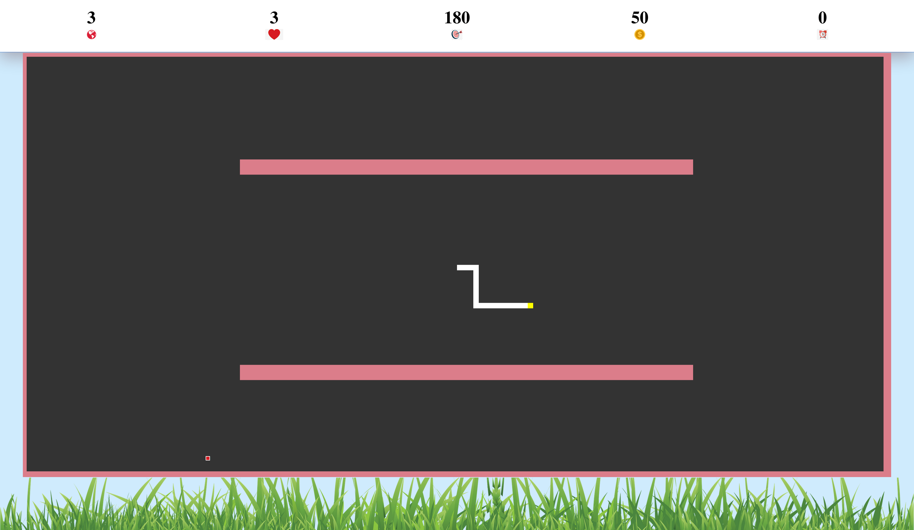

# MultiLevel-Snake-Game
> This game is made using p5js canvas. As it is designed in module form, anyone can clone this repo and customize easily https://karthiknedunchezhiyan.github.io/MultiLevel-Snake-Game

## Usage example

As it is easily customizable and adaptable to all screen size, you can add it to your web and mobile project,
For swipe hammerjs is used

You can also use this for machine learning algorithmns like genetic algorithm, neural network, neuro evoluation network and many others....

1. [main.js](src/js/main.js) has all the controller and game logic
2. [Environment.js](src/js/Environment.js) has environment controlls like food.
3. [snakeDNA.js](src/js/snakeDNA.js) has controlls like health, score, (velocity | position | scale ) of snake.
4. [map.js](src/js/map.js) has map controlls like levels.

Try this game in https://karthiknedunchezhiyan.github.io/MultiLevel-Snake-Game

## Meta

Karthik Nedunchezhiyan – [@Github](https://github.com/KarthikNedunchezhiyan) – karthik1705.n@gmail.com

Distributed under the MIT license. See ``LICENSE`` for more information.

## Contributing

1. Fork it (<https://github.com/KarthikNedunchezhiyan/MultiLevel-Snake-Game/fork>)
2. Create your feature branch (`git checkout -b feature/fooBar`)
3. Commit your changes (`git commit -am 'Add some fooBar'`)
4. Push to the branch (`git push origin feature/fooBar`)
5. Create a new Pull Request
6. Kindly open a issue if you found any bug
7. Share your suggestions and ideas
